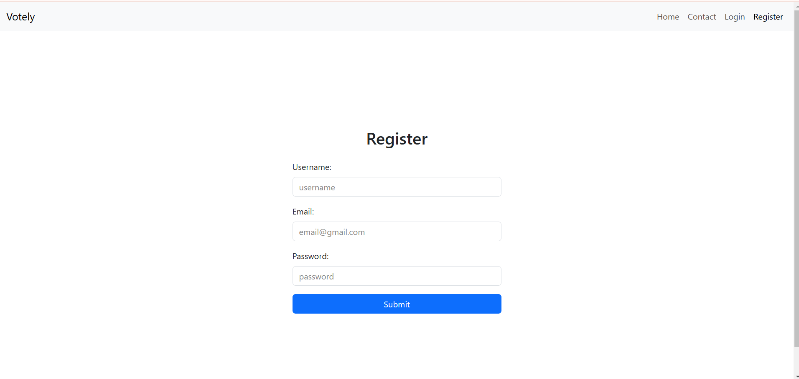

# Online Voting System

## Introduction
An online voting system built with React and Node.js, using MongoDB as the database. This project also utilizes Cloudinary for image storage.

## Technologies Used
- **Frontend**: React
- **Backend**: Node.js,Express
- **Database**: MongoDB,Blocakchain Database 
- **Image Storage**: Cloudinary

## Project Structure
The project is structured with separate schemas for registered users, candidates, administrators, and general users.

## Schemas

### Registered User Schema
The Registered User schema includes fields such as username, full name, age, date of birth, phone number, Aadhar number, voter ID, unique key, and a flag indicating whether the user has voted. All these fields are required, with unique constraints on username, Aadhar number, voter ID, and unique key to prevent duplication. The schema also includes timestamp fields to automatically record the creation and update times.

### Candidate Schema
The Candidate schema consists of fields for username, party, candidate name, voter ID, gender, photo, and a flag indicating if the candidate is selected. Each field is required, and the voter ID is unique to ensure no two candidates share the same ID. This schema also includes timestamps to track when records are created and updated.

### Admin Schema
The Admin schema includes fields for username, role (with a default value of 'admin'), creation date, and password. The username field is unique to prevent duplicate administrator accounts. The schema uses bcrypt to hash passwords for security and includes timestamps for record keeping.

### User Schema
The User schema has fields for username, email, and the date of account creation. The username and email fields are unique to prevent duplication, and the email field is also trimmed and converted to lowercase to ensure consistency. This schema tracks the date and time when each record is created.

## Features

### DFD (Data Flow Diagram)
_****_

### Architecture Design
_****_

### Homepage
_****_

### Admin Home Page
_****_

### Admin and User Login
_****_
_** **_

### Chatbot
_****_

### Register Page
_****_

### Voting Registration
_**![Voting Registration]]()**_

### News Page
_****_

### Approval Section
_****_

### Candidate Registration
_****_

### Voting Section
_****_

## Conclusion
This online voting system ensures secure and efficient voting processes, leveraging modern web technologies and robust database management.

## In Progress
